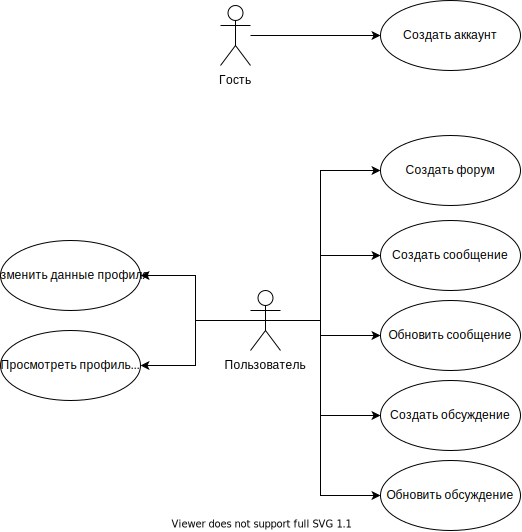

# Web-Project

##Цель работы.

Создание простого в использовании и настройке API форума.

##Краткий перечень функциональных требований.

1) Создание нового форума;
2) Получение информации о форуме по его идентификатору;
3) Добавление новой ветки обсуждения на форум;
4) Получение списка пользователей, у которых есть пост или ветка обсуждения в данном форуме;
5) Получение списка ветвей обсуждения данного форума;
6) Получение информации о ветке обсуждения по его идентификатору;
7) Получение информации о сообщении по его идентификатору;
8) Изменение сообщения на форуме;
9) Добавление новых постов в ветку обсуждения на форум;
10) Обновление ветки обсуждения на форуме;
11) Получение списка сообщений в данной ветке форуме;
12) Создание нового пользователя;
13) Получение информации о пользователе форума по его идентификатору;
14) Изменение информации в профиле пользователя.

##Use-case диаграмма системы.

##ER-диаграмма сущностей системы.

